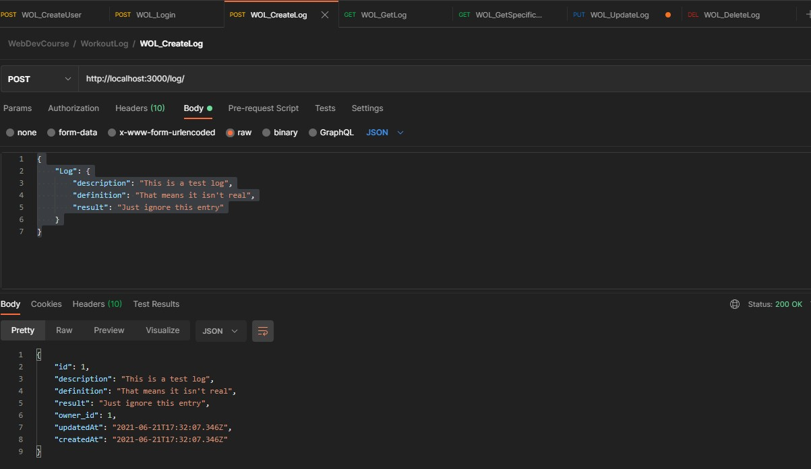
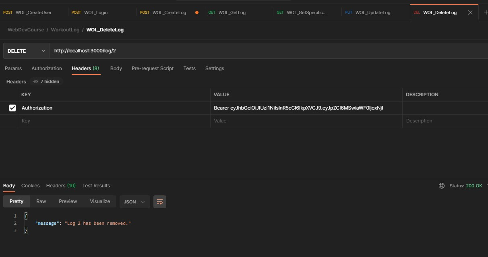
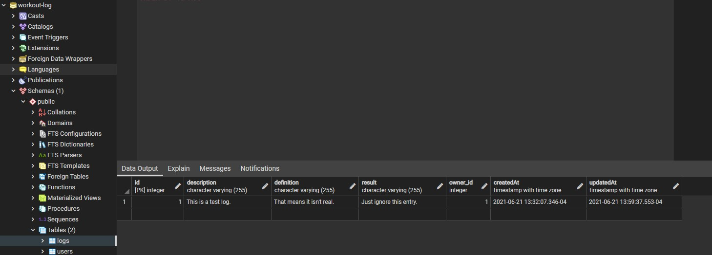
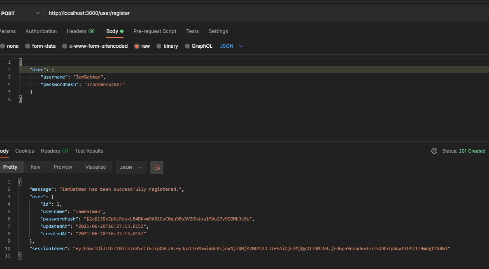
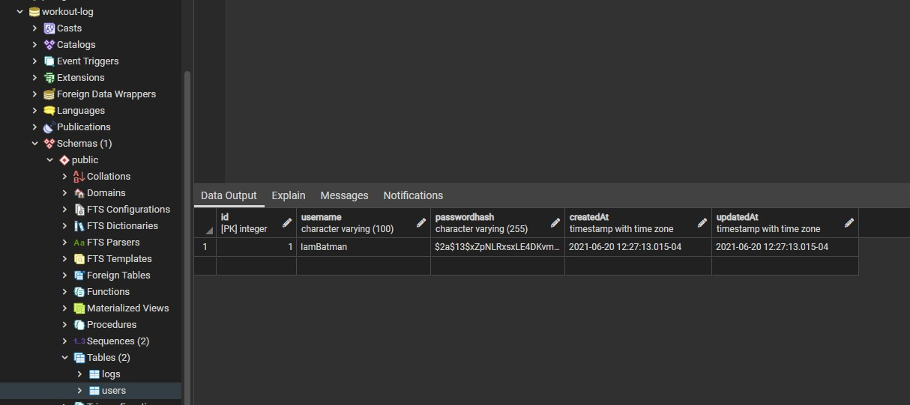
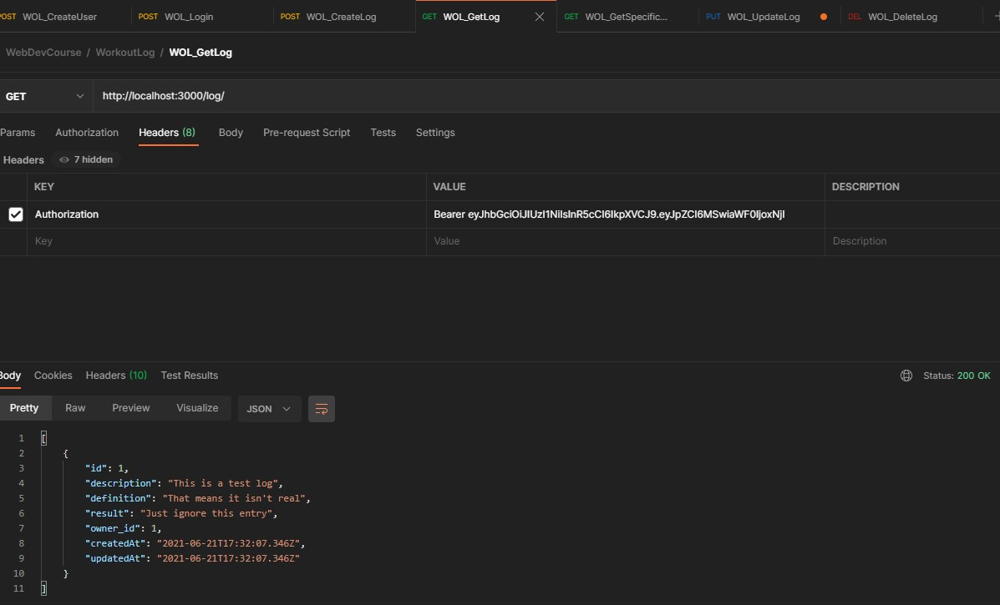
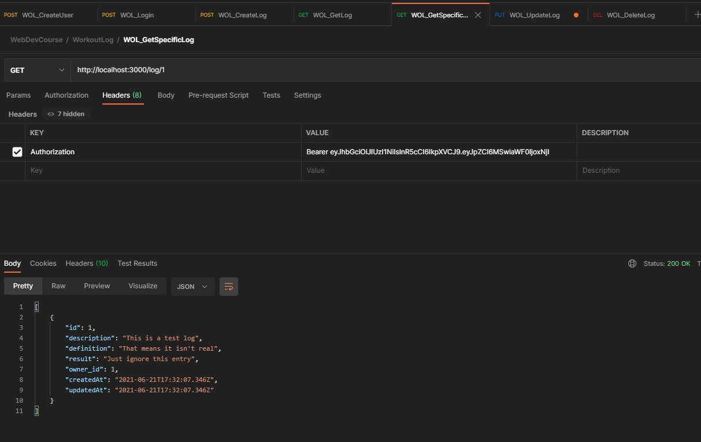
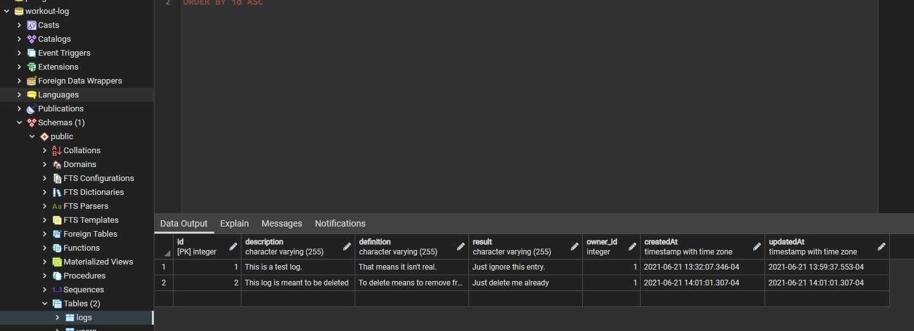
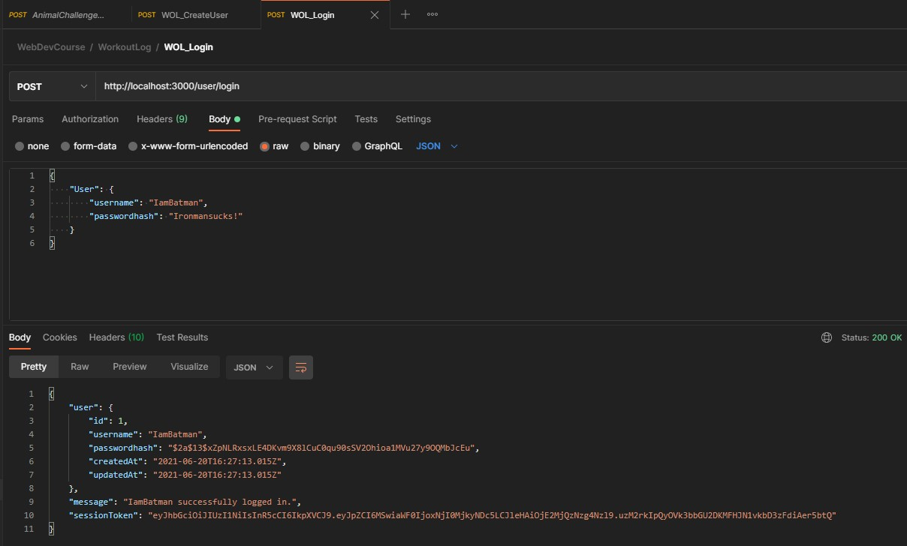
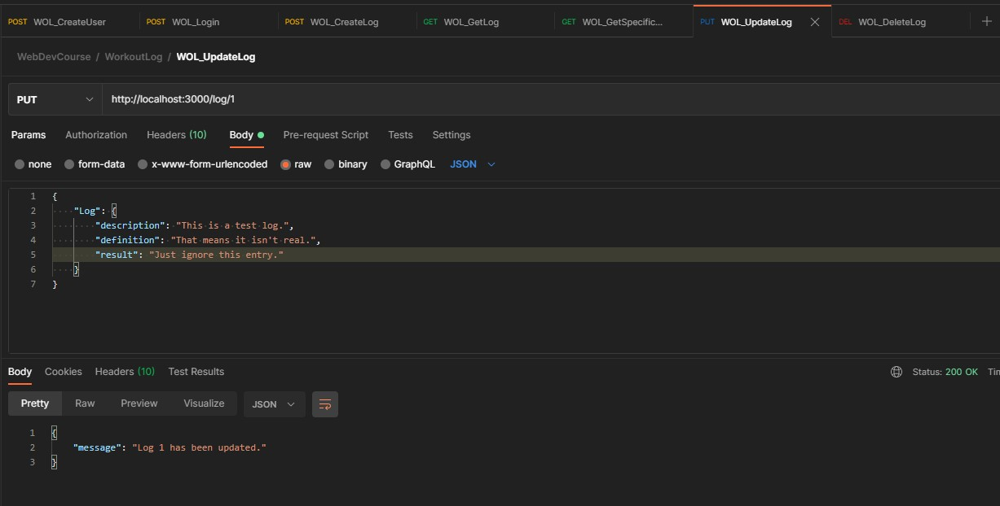

# workoutlog
Please find screenshots of testing for all appropriate routes on the server side of WOL:  
Create User  
Login  
Create Log  
Update Log  
Search all logs for user  
Search specific logs  
Delete Log  

All screenshots:  
 
 
 
 
 
 
 
 
 
 
